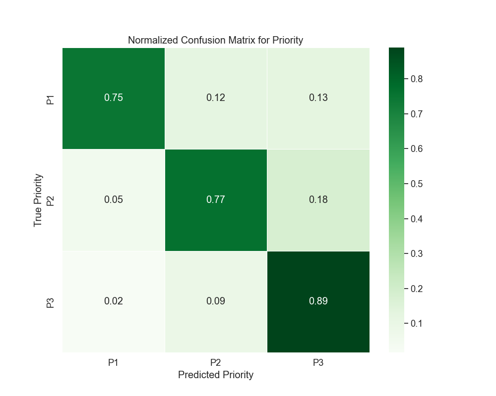
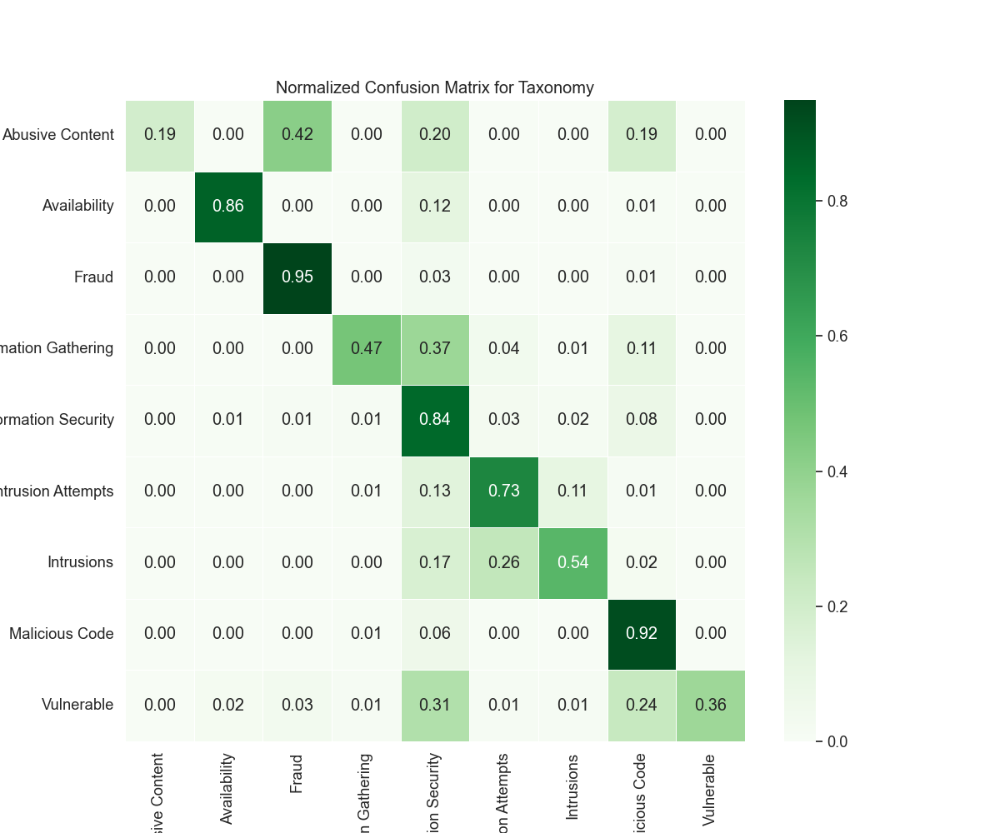

# Version 6 - Results Analysis

## Metric Explanation

- **Precision:** Ratio of correct positive predictions to all positive predictions made.
- **Recall:** Ratio of correct positive predictions to all actual positives.
- **F1-Score:** The harmonic mean of precision and recall.
- **Support:** The number of instances of each class in the test set.
- **Overall Accuracy:** The total proportion of correct predictions over all instances.

*Note: For Version 6, the dataset was split 70/30 (training/testing).*

---

## Model Parameters

The model used in this version was a **Random Forest** classifier with the following parameters:

- **n_estimators:** 100  
- **random_state:** 42  
- **max_depth:** 40  
- **min_samples_split:** 10  
- **min_samples_leaf:** 1  

Additionally, **TfidfVectorizer** was used to vectorize the `description` column before training.

---

## Priority Prediction Metrics

| Class | Precision | Recall | F1-Score | Support |
|:-----:|:---------:|:------:|:--------:|:-------:|
|   0   |   0.81    |  0.75  |   0.78   |  4162   |
|   1   |   0.81    |  0.77  |   0.79   |  9374   |
|   2   |   0.83    |  0.89  |   0.86   | 12462   |

**Overall Accuracy:** 82%  
**Macro Average:** Precision 0.82, Recall 0.80, F1-Score 0.81  
**Weighted Average:** Precision 0.82, Recall 0.82, F1-Score 0.82  

### Confusion Matrix for Priority

**Analysis:**
- **Class 2 (P3)** has the highest recall at 0.89, meaning most instances of this class were correctly identified.
- **Class 0 (P1)** has the lowest recall at 0.75, suggesting some misclassification towards other priorities.
- **False positives and false negatives** occur primarily between **P1 and P2**, as seen in the misclassifications present in the matrix.
- The model shows a **consistent performance across all priority levels**, with small drops in recall for lower-priority alerts.

---

## Taxonomy Prediction Metrics

| Class | Precision | Recall | F1-Score | Support |
|:-----:|:---------:|:------:|:--------:|:-------:|
|   0   |   0.82    |  0.19  |   0.31   |   394   |
|   1   |   0.94    |  0.86  |   0.90   |  1117   |
|   2   |   0.95    |  0.95  |   0.95   |  5937   |
|   3   |   0.78    |  0.47  |   0.59   |  1066   |
|   4   |   0.72    |  0.84  |   0.78   |  6051   |
|   5   |   0.78    |  0.73  |   0.75   |  3467   |
|   6   |   0.66    |  0.54  |   0.59   |  1890   |
|   7   |   0.86    |  0.92  |   0.89   |  5988   |
|   8   |   0.74    |  0.36  |   0.49   |    88   |

**Overall Accuracy:** 82%  
**Macro Average:** Precision 0.81, Recall 0.65, F1-Score 0.69  
**Weighted Average:** Precision 0.82, Recall 0.82, F1-Score 0.82  

### Confusion Matrix for Taxonomy

**Analysis:**
- **Class 2 (Fraud) and Class 7 (Malicious Code)** have the highest recall values (0.95 and 0.92, respectively), indicating that the model is very effective at detecting these categories.
- **Class 0 (Abusive Content)** shows a significantly lower recall of 0.19, meaning the model struggles to correctly classify these instances.
- **There is substantial misclassification among information security-related categories (Classes 3-6),** particularly in distinguishing between information gathering and intrusion attempts.
- The model does well in **highly represented classes** but still has **difficulty distinguishing minority classes**, particularly **Class 0 and Class 8 (Vulnerable).**

---

## Key Analysis Points

- **Priority Prediction:**
  - Performance is **consistent across priority levels**, but misclassification exists between adjacent priority levels.
  - Improving feature selection might help refine the distinction between **P1 and P2**.

- **Taxonomy Classification:**
  - The model correctly classifies **dominant attack types** but has trouble with **minority categories**.
  - **Class imbalances** contribute to weaker recall for low-represented categories (e.g., **Class 0, Class 8**).
  - Further improvements may require **rebalancing the dataset** or using **data augmentation techniques** to provide better training examples for rare attack types.

## Conclusion

Version 6’s results show an **82% accuracy for both priority and taxonomy classification**. The **priority model remains stable**, with only minor performance changes. The **taxonomy classifier shows improvements in dominant categories but struggles with underrepresented ones**. Future enhancements should focus on **handling class imbalance** and **fine-tuning feature selection** to better separate difficult-to-classify categories.

