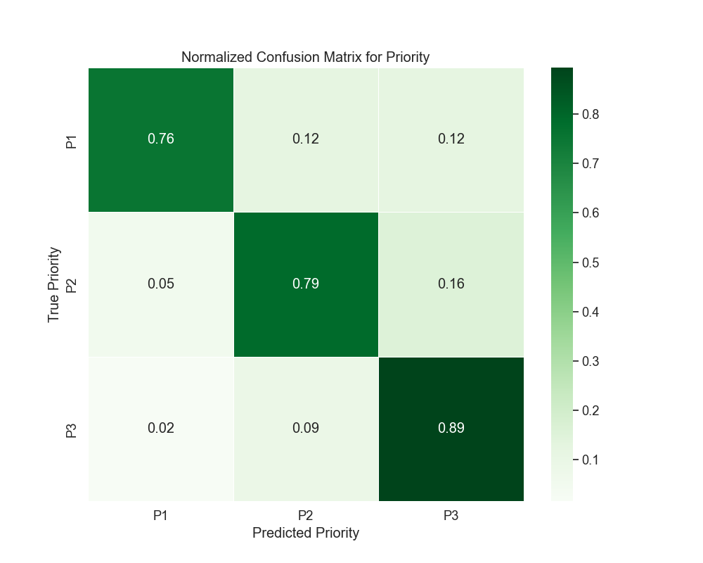
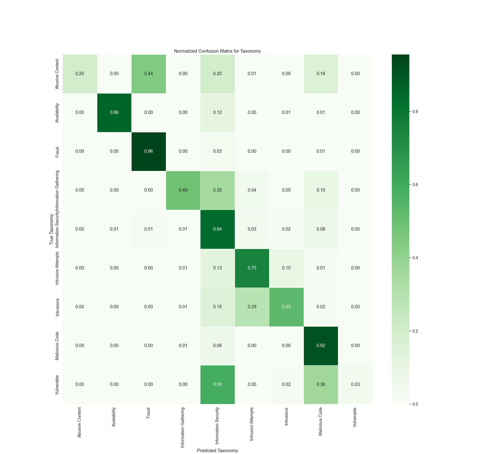

# Version 7 - Results Analysis

## Metric Explanation

- **Precision:** Ratio of correct positive predictions to all positive predictions made.
- **Recall:** Ratio of correct positive predictions to all actual positives.
- **F1-Score:** The harmonic mean of precision and recall.
- **Support:** The number of instances of each class in the test set.
- **Overall Accuracy:** The total proportion of correct predictions over all instances.

*Note: For Version 7, the dataset was split 70/30 (training/testing).*

---

## Model Parameters

The model used in this version was a **Random Forest** classifier with the following parameters:

- **n_estimators:** 100  
- **random_state:** 42  
- **max_depth:** 40  
- **min_samples_split:** 10  
- **min_samples_leaf:** 1  
- **class_weight:** 'balanced'  

Additionally, **TfidfVectorizer** was used to vectorize the `description` column before training.

---

## Priority Prediction Metrics

| Class | Precision | Recall | F1-Score | Support |
|:-----:|:---------:|:------:|:--------:|:-------:|
|   0   |   0.82    |  0.76  |   0.79   |  3957   |
|   1   |   0.82    |  0.79  |   0.80   |  8777   |
|   2   |   0.85    |  0.89  |   0.87   | 11786   |

**Overall Accuracy:** 83%  
**Macro Average:** Precision 0.83, Recall 0.81, F1-Score 0.82  
**Weighted Average:** Precision 0.83, Recall 0.83, F1-Score 0.83  

### Confusion Matrix for Priority

**Analysis:**
- **Class 2 (P3)** has the highest recall at 0.89, meaning most instances of this class were correctly identified.
- **Class 0 (P1)** has the lowest recall at 0.76, suggesting some misclassification towards other priorities.
- **False positives and false negatives** occur primarily between **P1 and P2**, as seen in the misclassifications present in the matrix.
- The model shows a **consistent performance across all priority levels**, with small drops in recall for lower-priority alerts.

---

## Taxonomy Prediction Metrics

| Class | Precision | Recall | F1-Score | Support |
|:-----:|:---------:|:------:|:--------:|:-------:|
|   0   |   0.75    |  0.20  |   0.31   |   369   |
|   1   |   0.94    |  0.86  |   0.89   |  1034   |
|   2   |   0.95    |  0.96  |   0.95   |  5440   |
|   3   |   0.78    |  0.49  |   0.60   |  1013   |
|   4   |   0.73    |  0.84  |   0.78   |  5787   |
|   5   |   0.77    |  0.75  |   0.76   |  3400   |
|   6   |   0.67    |  0.53  |   0.59   |  1780   |
|   7   |   0.87    |  0.92  |   0.89   |  5639   |
|   8   |   0.33    |  0.03  |   0.06   |    58   |

**Overall Accuracy:** 82%  
**Macro Average:** Precision 0.75, Recall 0.62, F1-Score 0.65  
**Weighted Average:** Precision 0.82, Recall 0.82, F1-Score 0.82  

### Confusion Matrix for Taxonomy

**Analysis:**
- **Class 2 (Fraud) and Class 7 (Malicious Code)** have the highest recall values (0.96 and 0.92, respectively), indicating that the model is very effective at detecting these categories.
- **Class 0 (Abusive Content)** shows a significantly lower recall of 0.20, meaning the model struggles to correctly classify these instances.
- **There is substantial misclassification among information security-related categories (Classes 3-6),** particularly in distinguishing between information gathering and intrusion attempts.
- The model does well in **highly represented classes** but still has **difficulty distinguishing minority classes**, particularly **Class 0 and Class 8 (Vulnerable).**

---

## Key Analysis Points

- **Priority Prediction:**
  - Performance is **consistent across priority levels**, but misclassification exists between adjacent priority levels.
  - The addition of **class_weight='balanced'** appears to slightly improve overall priority recall.
  
- **Taxonomy Classification:**
  - The model correctly classifies **dominant attack types** but has trouble with **minority categories**.
  - **Class imbalances** contribute to weaker recall for low-represented categories (e.g., **Class 0, Class 8**).
  - The use of **class_weight='balanced'** did not significantly improve recall in underrepresented classes.

---

## Comparison to Version 6

| Metric      | Version 6 | Version 7 |
|------------|----------|----------|
| Priority Accuracy | 82% | 83% |
| Taxonomy Accuracy | 82% | 82% |

- **Priority Accuracy improved by 1%**, suggesting that using **class_weight='balanced'** helps slightly in better classification.
- **Taxonomy Accuracy remains stable at 82%**, indicating that further refinements may be needed to boost classification performance for underrepresented classes.
- **Class-weighting helped balance priority classes**, but did not lead to a major improvement in taxonomy classification.

---

## Conclusion

Version 7’s results show an **83% accuracy for priority classification** and **82% accuracy for taxonomy classification**. The **addition of class weighting improved priority classification but had minimal effect on taxonomy accuracy**. Future work should focus on **further addressing class imbalances** and **tuning feature extraction methods** to enhance classification performance across all categories.

