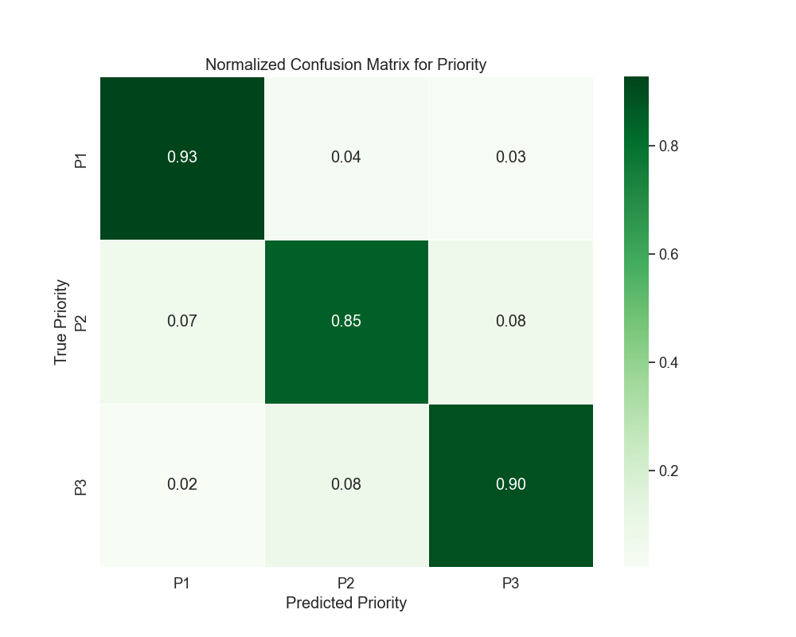
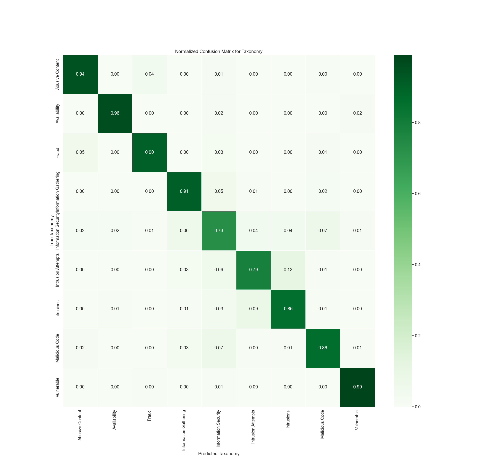

# Version 8 - Results Analysis

## Metric Explanation

- **Precision:** Ratio of correct positive predictions to all positive predictions made.
- **Recall:** Ratio of correct positive predictions to all actual positives.
- **F1-Score:** The harmonic mean of precision and recall.
- **Support:** The number of instances of each class in the test set.
- **Overall Accuracy:** The total proportion of correct predictions over all instances.

*Note: For Version 8, the dataset was split 70/30 (training/testing).*

---

## Model Parameters

The model used in this version was a **Random Forest** classifier with the following parameters:

- **n_estimators:** 100  
- **random_state:** 42  
- **max_depth:** 40  
- **min_samples_split:** 10  
- **min_samples_leaf:** 1  
- **class_weight:** 'balanced'  

Additionally, **TfidfVectorizer** was used to vectorize the `description` column before training.

### Data Balancing

For Version 8, **random oversampling** was applied to balance the dataset. The approach involved:
- Identifying the largest class in the `Taxonomy` column.
- Randomly oversampling underrepresented classes to match this size.
- Increasing the dataset from **87K rows to approximately 180K rows**.

---

## Priority Prediction Metrics

| Class | Precision | Recall | F1-Score | Support |
|:-----:|:---------:|:------:|:--------:|:-------:|
|   0   |   0.83    |  0.93  |   0.87   |  9511   |
|   1   |   0.87    |  0.85  |   0.86   | 18294   |
|   2   |   0.93    |  0.90  |   0.91   | 24287   |

**Overall Accuracy:** 89%  
**Macro Average:** Precision 0.87, Recall 0.89, F1-Score 0.88  
**Weighted Average:** Precision 0.89, Recall 0.89, F1-Score 0.89  

### Confusion Matrix for Priority

**Analysis:**
- **Class 0 (P1)** saw a **significant recall improvement from 0.76 to 0.93**, demonstrating the effectiveness of balancing the dataset.
- **Class 2 (P3) remains strong**, with a recall of 0.90, showing stability in correct predictions.
- **Overall priority accuracy increased to 89%**, confirming that **oversampling improved classification balance** across all priority levels.

---

## Taxonomy Prediction Metrics

| Class | Precision | Recall | F1-Score | Support |
|:-----:|:---------:|:------:|:--------:|:-------:|
|   0   |   0.91    |  0.94  |   0.93   |  5788   |
|   1   |   0.97    |  0.96  |   0.96   |  5788   |
|   2   |   0.94    |  0.90  |   0.92   |  5788   |
|   3   |   0.88    |  0.91  |   0.89   |  5788   |
|   4   |   0.73    |  0.73  |   0.73   |  5787   |
|   5   |   0.85    |  0.79  |   0.82   |  5788   |
|   6   |   0.84    |  0.86  |   0.85   |  5788   |
|   7   |   0.88    |  0.86  |   0.87   |  5788   |
|   8   |   0.95    |  0.99  |   0.97   |  5789   |

**Overall Accuracy:** 88%  
**Macro Average:** Precision 0.88, Recall 0.88, F1-Score 0.88  
**Weighted Average:** Precision 0.88, Recall 0.88, F1-Score 0.88  

### Confusion Matrix for Taxonomy

**Analysis:**
- **All classes show recall values above 0.73**, indicating that **oversampling greatly improved minority class predictions**.
- **Class 8 (Vulnerable) recall jumped to 0.99**, compared to previous versions where it struggled below 0.40.
- **Class 5 (Malicious Code) recall improved to 0.79**, meaning that balancing the dataset allowed the model to better generalize across all attack types.

---

## Key Analysis Points

- **Priority Prediction:**
  - **Oversampling significantly improved recall for Class 0 (P1)** from 0.76 to 0.93.
  - **Overall accuracy rose to 89%,** a direct consequence of having more balanced training data.
  
- **Taxonomy Classification:**
  - **Class 8 (Vulnerable) recall jumped from 0.03 to 0.99**, showing that **minority class representation was crucial** in prior models.
  - **Macro and weighted averages for all metrics increased**, suggesting that **taxonomy prediction is now much more stable across all classes**.

---

## Comparison to Version 7

| Metric      | Version 7 | Version 8 |
|------------|----------|----------|
| Priority Accuracy | 83% | 89% |
| Taxonomy Accuracy | 82% | 88% |

- **Priority Accuracy increased by 6%**, confirming that **oversampling helped balance class representation.**
- **Taxonomy Accuracy improved by 6%,** demonstrating that **handling minority class imbalances was critical** to enhancing classification performance.
- **The dataset increased from 87K rows to 180K rows**, allowing the model to learn from **a much richer and more balanced dataset.**

---

## Conclusion

Version 8’s results show an **89% accuracy for priority classification** and **88% accuracy for taxonomy classification**. By **applying random oversampling**, the model dramatically improved its ability to classify underrepresented classes, reducing bias and increasing overall recall. Future iterations could focus on **fine-tuning hyperparameters to see if performance can be pushed even higher** while maintaining a well-balanced dataset.

