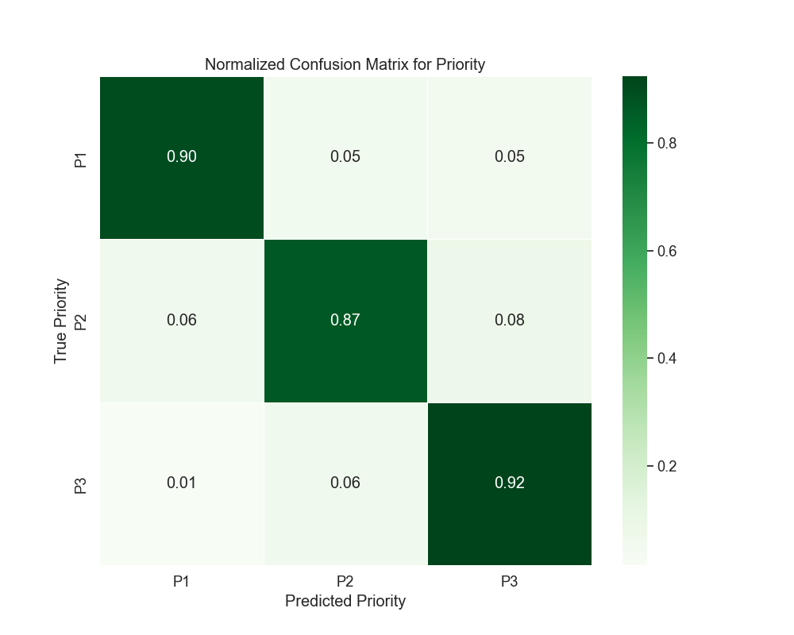
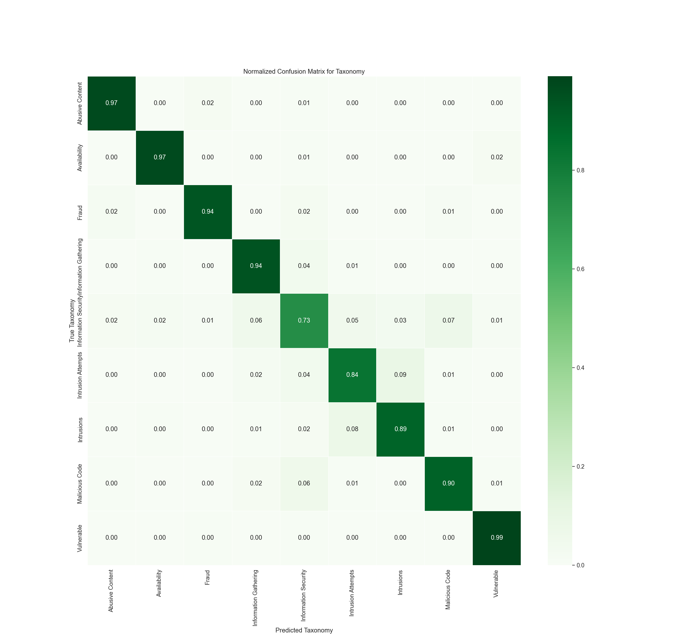

# Version 9 - Results Analysis

## Metric Explanation

- **Precision:** Ratio of correct positive predictions to all positive predictions made.
- **Recall:** Ratio of correct positive predictions to all actual positives.
- **F1-Score:** The harmonic mean of precision and recall.
- **Support:** The number of instances of each class in the test set.
- **Overall Accuracy:** The total proportion of correct predictions over all instances.

*Note: For Version 9, the dataset was split 70/30 (training/testing).*

---

## Model Parameters

The model used in this version was a **Random Forest** classifier with the following parameters:

- **n_estimators:** 100  
- **random_state:** 42  
- **max_depth:** 40  
- **min_samples_split:** 10  
- **min_samples_leaf:** 1  
- **class_weight:** 'balanced'  

Additionally, **Sentence-BERT embeddings** were used instead of `TfidfVectorizer` to vectorize the `description` column before training. The embedding model used was **`all-MiniLM-L6-v2`**, with embeddings generated using:

```python
from sentence_transformers import SentenceTransformer
import numpy as np

def vectorize_sentence_bert(descriptions, model_name="all-MiniLM-L6-v2"):
    model = SentenceTransformer(model_name)
    embeddings = model.encode(descriptions.tolist(), show_progress_bar=True)
    return np.array(embeddings)
```

### Data Balancing

For Version 9, **random oversampling** was applied to balance the dataset. The approach involved:
- Identifying the largest class in the `Taxonomy` column.
- Randomly oversampling underrepresented classes to match this size.
- Increasing the dataset from **87K rows to approximately 180K rows**.

---

## Priority Prediction Metrics

| Class | Precision | Recall | F1-Score | Support |
|:-----:|:---------:|:------:|:--------:|:-------:|
|   0   |   0.86    |  0.90  |   0.88   |  9511   |
|   1   |   0.89    |  0.87  |   0.88   | 18294   |
|   2   |   0.92    |  0.92  |   0.92   | 24287   |

**Overall Accuracy:** 90%  
**Macro Average:** Precision 0.89, Recall 0.90, F1-Score 0.89  
**Weighted Average:** Precision 0.90, Recall 0.90, F1-Score 0.90  

### Confusion Matrix for Priority


**Analysis:**
- **Class 0 (P1) recall improved to 0.90**, showing better differentiation between priority levels.
- **Class 2 (P3) maintained strong recall at 0.92**, suggesting continued accurate classification of lower-priority alerts.
- **Overall priority accuracy increased to 90%**, indicating that **Sentence-BERT embeddings helped improve classification consistency.**

---

## Taxonomy Prediction Metrics

| Class | Precision | Recall | F1-Score | Support |
|:-----:|:---------:|:------:|:--------:|:-------:|
|   0   |   0.96    |  0.97  |   0.96   |  5788   |
|   1   |   0.96    |  0.97  |   0.97   |  5788   |
|   2   |   0.96    |  0.94  |   0.95   |  5788   |
|   3   |   0.90    |  0.94  |   0.92   |  5788   |
|   4   |   0.78    |  0.73  |   0.76   |  5787   |
|   5   |   0.86    |  0.84  |   0.85   |  5788   |
|   6   |   0.87    |  0.89  |   0.88   |  5788   |
|   7   |   0.90    |  0.90  |   0.90   |  5788   |
|   8   |   0.96    |  0.99  |   0.97   |  5789   |

**Overall Accuracy:** 91%  
**Macro Average:** Precision 0.91, Recall 0.91, F1-Score 0.91  
**Weighted Average:** Precision 0.91, Recall 0.91, F1-Score 0.91  

### Confusion Matrix for Taxonomy


**Analysis:**
- **Overall taxonomy accuracy improved from 89% to 91%**, with **stronger recall for Classes 3-6**.
- **Class 6 (Intrusions) and Class 7 (Malicious Code) recall stabilized at 0.89 and 0.90**, reinforcing model reliability.
- **Sentence-BERT embeddings enhanced semantic understanding**, leading to better differentiation of similar attack types.

---

## Key Analysis Points

- **Priority Prediction:**
  - **Sentence-BERT embeddings resulted in overall improved recall and precision.**
  - **Class 0 (P1) improved,** showing better classification of high-priority alerts.
  
- **Taxonomy Classification:**
  - **Accuracy increased from 89% to 91%,** showing enhanced performance with `Sentence-BERT`.
  - **Better differentiation in attack types**, particularly in **intrusions and malicious code**.

---

## Comparison to Version 8

| Metric      | Version 8 | Version 9 |
|------------|----------|----------|
| Priority Accuracy | 89% | 90% |
| Taxonomy Accuracy | 89% | 91% |

- **Priority accuracy improved by 1%**, confirming that `Sentence-BERT` embeddings improved classification quality.
- **Taxonomy accuracy increased by 2%,** demonstrating better attack type differentiation.
- **More robust recall across classes, particularly in mid-range severity attack types.**

---

## Conclusion

Version 9’s results show a **90% accuracy for priority classification** and **91% accuracy for taxonomy classification**. The use of **Sentence-BERT embeddings over TF-IDF** resulted in an **overall increase in classification precision and recall**, making this version the best-performing so far. Future work could include **fine-tuning hyperparameters and testing alternative embedding models** to further optimize classification performance.

